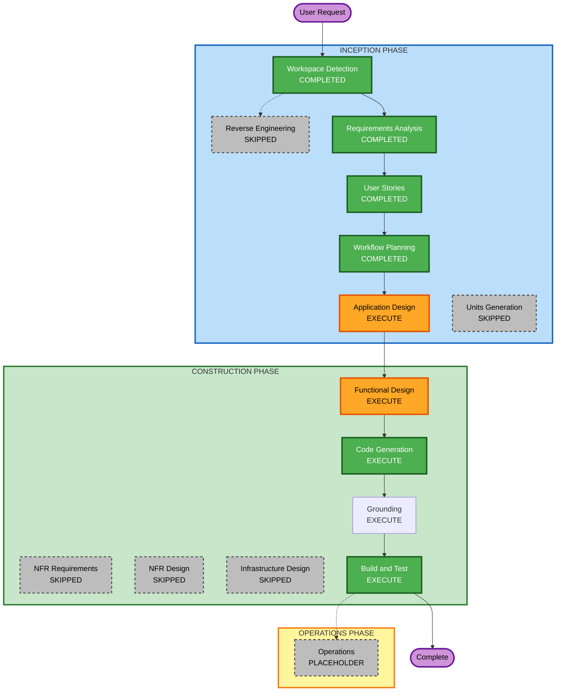

# Execution Plan

## Detailed Analysis Summary

### Change Impact Assessment
- **User-facing changes**: Yes — interactive CLI, streaming output, Markdown research files
- **Structural changes**: Yes — new greenfield application with multiple integrated components
- **Data model changes**: Yes — research output schema, session state, log entry structure
- **API changes**: N/A — new project, no existing APIs being modified
- **NFR impact**: Yes — security extension (fully enforced), PBT (partial), verbose structured logging, error resilience

### Risk Assessment
- **Risk Level**: Medium
- **Rollback Complexity**: Easy (greenfield; nothing to roll back to)
- **Testing Complexity**: Moderate (external service integrations require mocking; streaming adds complexity)
- **Key Risk Factors**:
  - Three Tavily API integrations with distinct behaviors
  - Strands Agents SDK streaming implementation
  - Security extension fully enforced — blocking findings must be resolved at each stage

---

## Units of Work

Single unit — no decomposition needed (user decision: single application):

| Unit | Name | Scope |
|---|---|---|
| Unit 1 | Deep Research Agent | CLI entry point, Strands agent setup, Bedrock LLM integration, Tavily tools (search, extract, crawl), streaming output, session REPL loop, Markdown file generation, structured logging, session correlation IDs |

---

## Workflow Visualization

### Mermaid Diagram



### Text Alternative

```
INCEPTION PHASE
  [DONE] Workspace Detection
  [SKIP] Reverse Engineering
  [DONE] Requirements Analysis
  [DONE] User Stories
  [DONE] Workflow Planning
  [EXEC] Application Design
  [SKIP] Units Generation

CONSTRUCTION PHASE
  [EXEC] Functional Design
  [SKIP] NFR Requirements
  [SKIP] NFR Design
  [SKIP] Infrastructure Design
  [EXEC] Code Generation
  [EXEC] Grounding
  [EXEC] Build and Test

OPERATIONS PHASE
  [----] Operations (Placeholder)
```

---

## Phases to Execute

### 🔵 INCEPTION PHASE
- [x] Workspace Detection — COMPLETED
- [x] Reverse Engineering — SKIPPED (Greenfield)
- [x] Requirements Analysis — COMPLETED
- [x] User Stories — COMPLETED
- [x] Workflow Planning — COMPLETED
- [ ] Application Design — **EXECUTE**
  - *Rationale*: New greenfield project; component boundaries, methods, and service layer need definition before implementation
- [ ] Units Generation — **SKIP**
  - *Rationale*: Single application — no decomposition needed (user decision)

### 🟢 CONSTRUCTION PHASE
- [ ] Functional Design — **EXECUTE**
  - *Rationale*: Complex orchestration logic (Strands tool registration, streaming pipeline, REPL loop), data models (output schema, log structure), and business rules (error handling, session lifecycle) require detailed functional design
- [ ] NFR Requirements — **SKIP**
  - *Rationale*: Simple CLI tool — no complex NFRs beyond what is already captured in requirements.md (user decision)
- [ ] NFR Design — **SKIP**
  - *Rationale*: No NFR requirements stage to design from (user decision)
- [ ] Infrastructure Design — **SKIP**
  - *Rationale*: Local CLI — no cloud infrastructure to provision (user decision)
- [ ] Code Generation — **EXECUTE** (ALWAYS)
- [ ] Build and Test — **EXECUTE** (ALWAYS)

### 🟡 OPERATIONS PHASE
- [ ] Operations — PLACEHOLDER (future expansion)

---

## Stages to Skip (with Rationale)

| Stage | Reason |
|---|---|
| Reverse Engineering | Greenfield project — no existing code |
| Units Generation | Single application — no decomposition needed |
| NFR Requirements | Simple CLI tool — no complex NFRs beyond requirements.md |
| NFR Design | No NFR Requirements stage to design from |
| Infrastructure Design | Local CLI — no cloud infrastructure to provision |
| Operations | Placeholder stage; no deployment workflow defined |

---

## Estimated Sequence

1. Application Design
2. Functional Design
3. Code Generation
4. Build and Test

---

## Success Criteria
- **Primary Goal**: A working deep research agent CLI with interactive REPL, streaming Bedrock output, Tavily search/extract/crawl tools, and Markdown output files
- **Key Deliverables**: Python package installable via `uv`, all 13 user stories met, security extension compliant, PBT (partial) compliant
- **Quality Gates**: All SECURITY rules verified at each stage; PBT-02/03/07/08/09 verified at Code Generation; tests pass via `uv run pytest`
